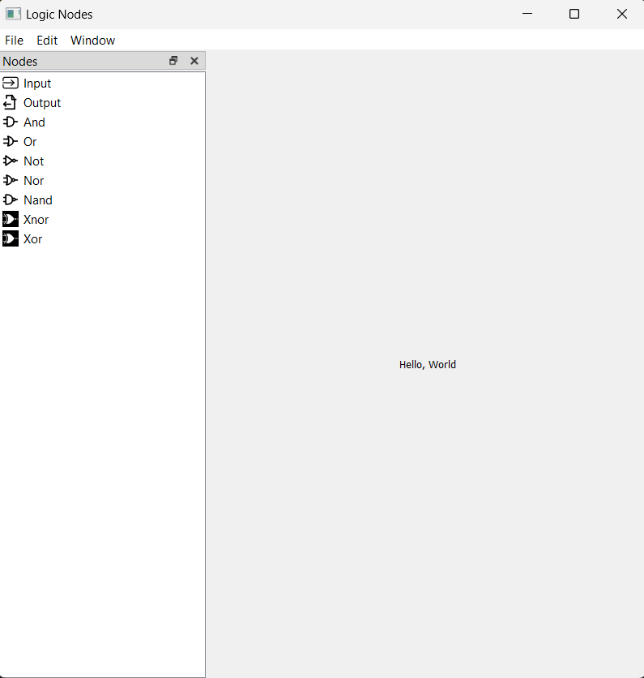

# Logic-Nodes-GUI
 Make a GUI application to simulate basic logic gates using nodes with PyQt

# Screenshot 

# Sources
https://realpython.com/python-menus-toolbars/#building-python-menu-bars-menus-and-toolbars-in-pyqt
